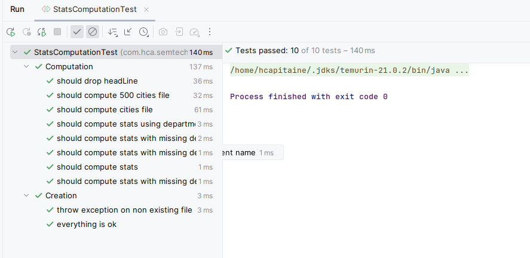
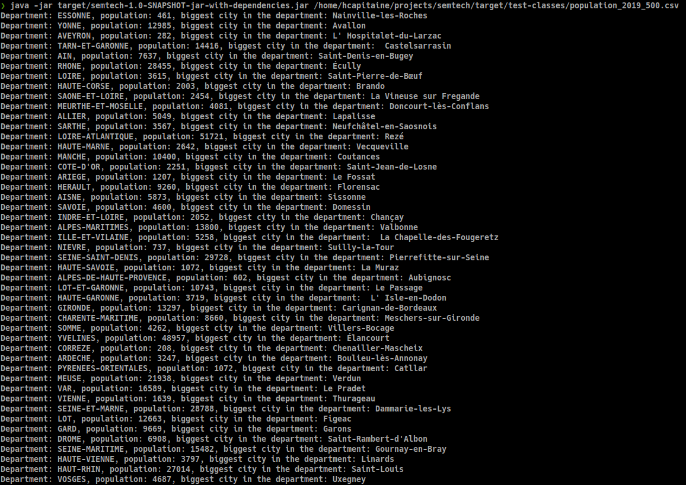
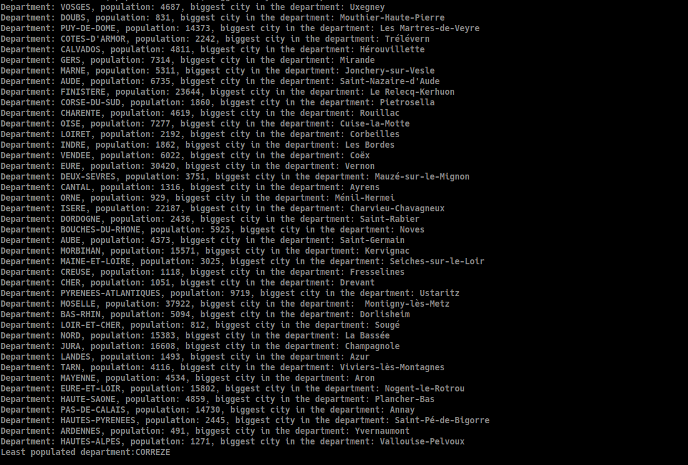

# coding-interview

## The exercise
You've been given CSV files (e.g. _population_2019_500.csv_). The files contain the population of French cities.  
We would like you to write a program that takes a CSV file as input and print to stdout:
* a line for each department with:
  * the department name
  * the total population for the department
  * the city with the largest population
* a line with the department name with the smallest population

## More instructions
* write your code in Java or Scala
* tend to minimize the use of external dependencies (not forbidden)
* provide instructions to run your program
* provide tests and instructions to run your tests

## Even more instructions about industrialization
We rely a lot in automation for build/release and deploy, 

* can you propose a test/pull-request workflow and a build workflow using GHA or any solution you have access/knowledge ?
* can you propose a solution to host a simple service on which we would feed this csv and get the output result ?

## How to submit your solution
Send us an archive of the project.

## Good luck!
Please don’t spend more than 2 hours on this exercise, and let us know if you have any questions.

## Solution proposed

The application uses maven to manage dependencies, build lifecycle including tests and packaging. 
Java version required: 21 as declared in the pom.

No need to install maven on your local machine, a maven wrapper is included and can be used that way:

`./mvnw clean install` for instance.

### Dependencies
The only dependencies added are tests libraries `junit5` and `assertj` for tests assertions. 

Library `common-lang` for string utils.

Nothing more.

### Running the tests

The tests can be run using maven:

`./mnvw test`

or using your IDE, on Intellij it renders that way:

Only one unit test class `StatsComputationTest` has been created to test the business of computation. 
If this computation class was used in a lambda, an integration test could have been created to test the output rendered. See section how it could be deployed.

This test class is divided into 2 major parts and tests can be read easily and used as documentation.

### Running the application

The application can be packaged using:
`./mvnw clean install`

Then running the jar:
`java -jar target/semtech-1.0-SNAPSHOT-jar-with-dependencies.jar /home/hcapitaine/projects/semtech/target/test-classes/population_2019_500.csv`

You can change the path to the csv file as you need.

The application should output in your terminal an output like this:

### CI/CD

I didn't use github for a long time and I'm more confortable with gitlab at the time but I'm pretty sure both can achieve the same purpose. 

On gitlab, I would be in favor of trunk based development. Every branches are started from main branch.
Every PR would ensure that compilation, tests (unit and in memory integration ones only, arch unit if exists and needed) are runned.
Once reviewed by peers, the PR can be merged on main branch. 

On main branch compilation, same tests as runned on PR, automatic deployment of database upgrades in test environment using liquibase or equivalent, automatic deployment of application(s) in test environment, 
running acceptance tests E2E if needed and exists (front end tests using, or api tests).

If the code uses feature flag, activation of the feature flag manually by human tester then deployment in production. 
Automatic update of DB, deployment of applications (depending on the infrastructure and IAC framework used).
Manual activation of the given FF.

### Deployment on infra

If we can use AWS, I would propose 2 infra depending on the size of the file.

If the size of the CSV file when uploaded do not exceed 30s (api gateway timeout for rest call) and 10 240MB (ephemeral storage on lambda), I would propose a simple application on lambda that would read the csv content and store it in ephemeral storage then output the result in the HTTP response.

If the size exceeds one of these limit, I would expose a lambda that would receive in the request an id and a callback url to contact the consumer once the computation is done. In the response I would return a ephemeral and secured S3 link that would allow the user to upload the file on S3. The lambda would store all these ids, callback url and S3 link in db so it can be tracked and deleted over time.
Once the user has uploaded the csv file on S3, a lambda would be automatically triggered to read the outputstream from S3 and compute the stats and then write in a new file the output that could be downloaded from S3. 
Finally, the lambda would call the callback url so the consumer knows he can download the file, no need for the consumer to trigger a call every X seconds, minutes.

